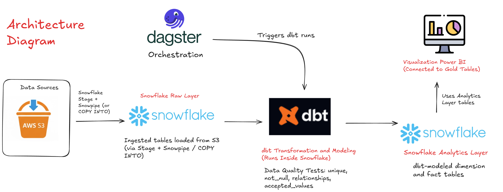
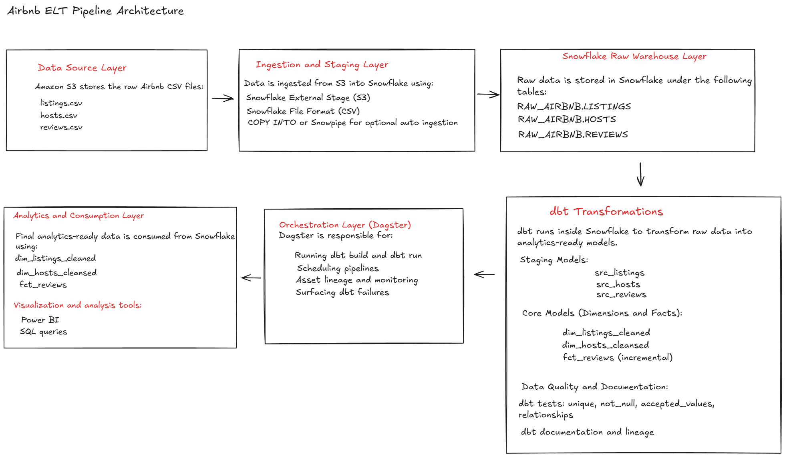
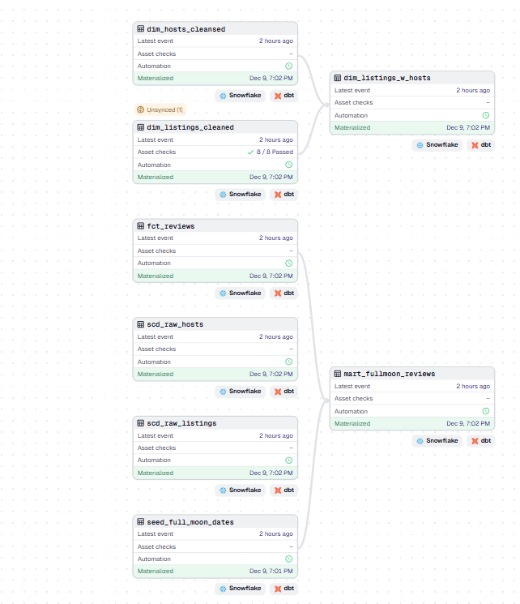

# 🏠 Airbnb Data Engineering Project (S3 → Snowflake → dbt → Dagster → Power BI)

## 📘 Project Overview  
This project demonstrates an **end-to-end modern data engineering pipeline** built using the **Airbnb dataset**.  
The objective is to design, automate, transform, test, and visualize data using a **cloud-native analytics stack** centered around **AWS S3, Snowflake, dbt, and Dagster**.

The pipeline covers the full lifecycle:
- Raw data ingestion from S3  
- Cloud data warehousing in Snowflake  
- Transformations and data quality using dbt  
- Orchestration using Dagster  
- Analytics and reporting using Power BI  

---

## 🧩 Architecture  




### High-Level Flow  
1. Airbnb CSV files land in **AWS S3**  
2. Data is loaded into **Snowflake Raw Layer** using **Snowflake Stage + Snowpipe or COPY INTO**  
3. **dbt runs inside Snowflake** to transform raw data into analytics-ready models  
4. **Dagster orchestrates dbt runs**  
5. **Power BI connects to Snowflake Analytics Layer** for reporting  

---

## ⚙️ Data Ingestion Pipeline (AWS S3 → Snowflake)

### 🔹 Ingestion Mechanism  
- **Source:** AWS S3  
- **Target:** Snowflake Raw Layer  
- **Method:**  
  - Snowflake External Stage  
  - Snowpipe or manual COPY INTO  

This enables scalable, cloud-native ingestion without intermediate compute.

---

## 🔁 Data Transformation and Modeling (dbt)

All transformations are implemented using **dbt running directly inside Snowflake**.

### 🔹 dbt Modeling Layers  
- **Staging Models (src_)**
  - `src_listings`  
  - `src_hosts`  
  - `src_reviews`  

- **Core Models**
  - `dim_listings_cleaned`  
  - `dim_hosts_cleansed`  
  - `fct_reviews` (incremental model)  

---

## 🔄 Incremental Processing  

The **fact reviews table** is built using:
- Surrogate keys  
- Incremental filtering on `review_date`  
- Efficient delta loading instead of full refreshes  

---

## ✅ Data Quality and Testing  

The following **dbt tests** are implemented:

- `unique`  
- `not_null`  
- `relationships`  
- `accepted_values`  
- `positive_values`  

These tests ensure:
- Primary key integrity  
- Referential consistency  
- No invalid or negative values  
- Clean analytics-ready datasets  

---

## ⏱️ Orchestration with Dagster  



Dagster is used for:

- Scheduling dbt runs  
- Manually triggering dbt pipelines  
- Monitoring asset execution  
- Tracking failures and retries  

Dagster controls **when dbt runs**, while dbt controls **how transformations are performed**.

---

## 📊 Analytics and Visualization (Power BI)  

Power BI connects directly to the **Snowflake Analytics Layer**.

## 📊 Dashboard Previews

### 🟩 Airbnb Listings and Review Performance Overview


A high-level analytical overview of Airbnb listings, review volume, sentiment distribution, and long-term review trends.

**Key Highlights:**
- Interactive filters for Room Type, Host Type, Full Moon, and Review Period  
- KPIs: Total Listings, Total Reviews, Average Price, Positive Review Percentage  
- Listings by Room Type  
- Review Volume: Full Moon vs Regular Days  
- Listings by Host Type (Superhost vs Regular Host)  
- Review Sentiment Breakdown (Positive, Neutral, Negative)  
- Review Trend Over Time  

--- 

### 🟦 Host and Pricing Performance Analysis


This dashboard provides insights into how hosts price their listings and how reviews vary across different hosts and room types.

**Key Highlights:**
- Total Listings by Host Name  
- Average Price by Host Type (Superhost vs Regular Host)  
- Average Price by Room Type  
- Top Hosts by Total Reviews  
- Listing-level details including:  
  - Room type  
  - Price  
  - Total reviews  
  - Positive review percentage  

---


---

## 🧱 Tech Stack  

| Layer | Tools and Services |
|------|---------------------|
| Data Source | AWS S3 |
| Ingestion | Snowflake Stage, Snowpipe, COPY INTO |
| Data Warehouse | Snowflake |
| Transformation | dbt |
| Orchestration | Dagster |
| Visualization | Power BI |
| Language | SQL, Jinja |
| Version Control | Git, GitHub |

---

## 🗂️ Dataset Overview  

**Source:** Public Airbnb Open Dataset  

The dataset includes:
- Listings information  
- Host details  
- Customer reviews  
- Availability metrics  

---

## 🧮 Data Model Overview  

| Table | Description |
|--------|-------------|
| `dim_listings_cleaned` | Cleaned Airbnb listing information |
| `dim_hosts_cleansed` | Host level attributes |
| `fct_reviews` | Incremental fact table for reviews |

---

## ⚙️ Key Features  

- End-to-end **ELT pipeline using Snowflake and dbt**  
- **Incremental fact modeling**  
- **Automated orchestration using Dagster**  
- **Enterprise-grade data quality checks**  
- **Cloud-native ingestion from S3**  
- **Analytics-ready Power BI reporting**  

---

## 📁 Repository Structure  

## 📁 Repository Structure

```text
├── analyses/
├── assets/
├── macros/
├── models/
│   ├── src/
│   ├── dimensions/
│   └── facts/
├── seeds/
├── snapshots/
├── tests/
├── architecture/
│   └── airbnb_architecture.png
├── dashboards/
│   ├── host_pricing_analysis.png
│   └── listings_review_overview.png
├── dagster/
│   └── dagster_pipeline.png
├── dbt_project.yml
├── packages.yml
└── README.md

